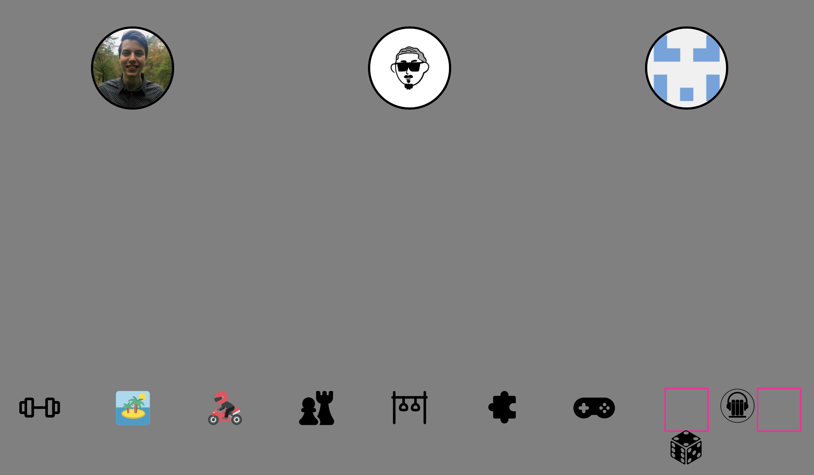
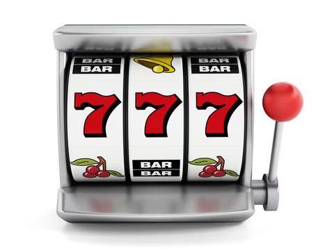
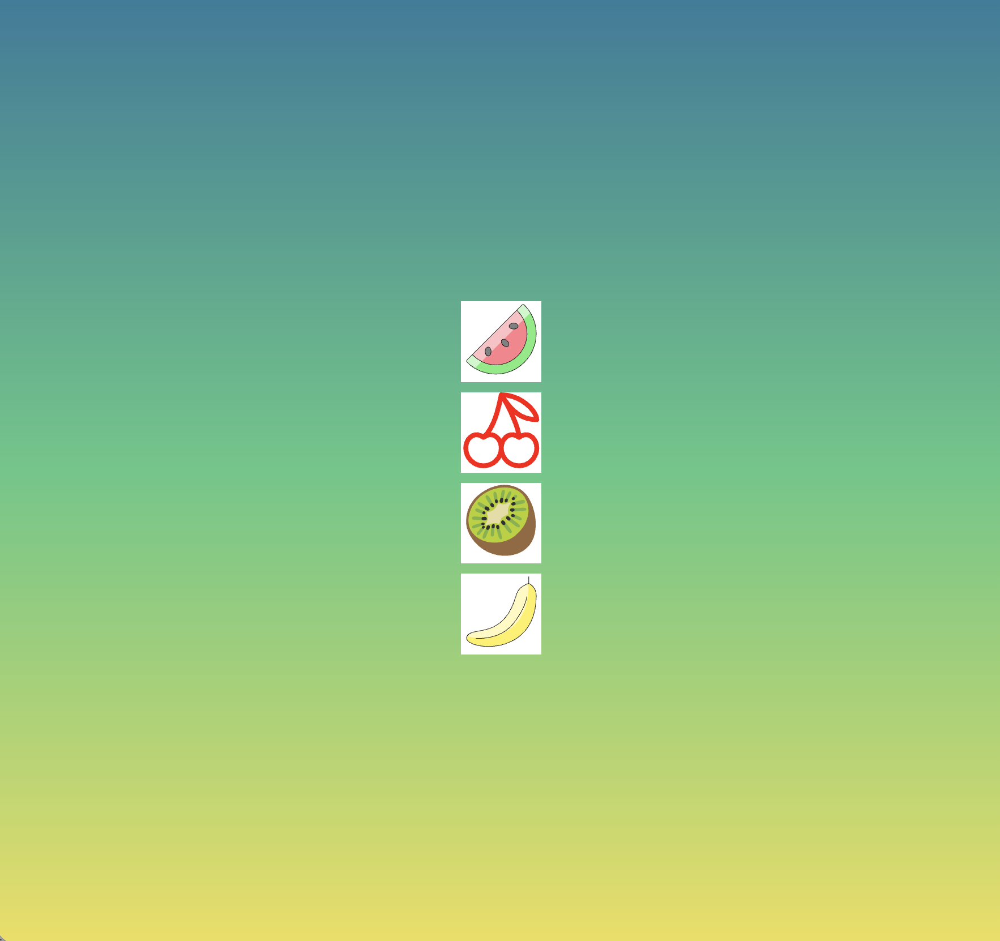

# Sprint 2
## Week 1/ Dag 1
**Wat heb ik vandaag gedaan:**
Tijdens de eerste dag van CSS to de rescue hebben een oefening gedaan om te oefenen met css selectors wat ik heel lastig vond omdat ik gewend ben om id of classes te gerbuiken. Na dat hebben we groepjes gemaakt om een theorie uit te werken en dat te presenteren aan andere studenten de volgende dag. Mijn groepje had ankers om uit te werken. Ik had uiteindelijk een klein spelletje gemaakt die hobbys van de ene anker naar de andere anker annimeert. 

Wat ik heel interessant vond is dat het animeren van ankers niet heel makelijk is. In de artikel stond dat je ankers op alle elementen kan gebruiken maar er stond niet of je elke element kan animeren wat dus bij mij niet heel goed ging.

**Hoelang duurde het:**
Het duurde mij 4 uurtjes om het goed te krijgen

**Wat heb ik geleerd:**
Ik heb geleerd hoe je kan werken met ankers wat ik zelf beter vind werken dan position absolut. Het geeft je veel vrijheid om posities te bepalen.

**Wat ga ik morgen doen:**
Morgen ga ik de theorie presenteren en aan de hand van wat we hebben gemaakt laten zien wat je ermee kan. Daarna krijgen we te horen wat de eindopdracht is en wat de regels zijn. Ik wil dat bepalen wat ik ga doen en als het kan al beginnen met een plan. 

## Week 1/ Dag 2

**Wat heb ik vandaag gedaan:**
Vandaag hebben we te horen gekregen wat de eindopdracht is. Er waren 4 opdrachten waar we uit mochten kiezen. Ik heb gekozen om de controlpanel opdrachte te gaan maken.

Mijn idee is om een slotmachine te gaan maken zoals we die kennen in de casino.

Ik heb hierover met Sanne en Nils gesproken wat mijn besluit definitief maakte. Ik heb met Nils nog gesproken over hoe ik dit zou kunnen aanpakken. Aan de hand van een schets heeft hij dit kunnen uitleggen aan mij.
 

Ik heb toen een schets gemaakt van het ontwerp die ik wil gaan realiseren.

**Hoelang duurde het:**
Om tot op een idee te komen en een begin te maken duurde het mij ongeveer 2 uurtjes.

**Wat heb ik geleerd:**
Ik heb geleerd hoe ik een gradiend kan toepassen. Het werkte niet goed omdat ik de gradiend op de body deed maar de body is een element met een uitzondering en dat ik de hoogte moet geven van de body voor dat het echt kan werken.

**Wat ga ik morgen doen:**
Morgen ga ik mijn idee vertellen in de feedback groep en een beginnetje maken aan de eerste wiel van mijn slotmachine.

## Weekly Nerd (Peter paul koch)
Tijdens deze weekly nerd kwam gast spreker Peter paul koch praten over de history van browser tech. Hij ging uitleggen hoe de browser werkt en welke routes het maakt om webpaginas te tonen. Dat is iets wat ik eerder al gehoord had maar het was wel fijn om een refresher te krijgen.

Wat ik vooral interast vond was de geschiedenis van de browser. Ik heb mij hier nooit in verdiept wat nieuw voor mij was. De browser is heel vergekomen. Er waren zoveel browser vroeger waar ik zelf niks over had gehoord. 

Wat ik nog had willen weten was wat hij vond van browsers die in de darkweb zijn zo als de thor browser. Helaas was ik dat nog vergeten te vragen.

Notes

Een browser is verbonden aan het web
Wat is een browser: 
Html: elementen
Css: hoe het eruit ziet 

Dom: document object model. Kan javascript lezen. 

Aom: accecebility object model: is voor voornamelijk bedoeld voor dingen zo als screenreader (assistent tech)

Interface: de elementen zo als buttons en searchbars

Javascript engine(als aparte component): is officieel geen onderdeel van de browser.

Parser: stukje programa dat een string neemt en inteperteerd en vertaal naar instructie die programma begrijpt

Browser Rendering engine: alles behalve javascript engine en interface.

Chrome en edge en opra en veel meer gebruiken engine: blink/chromium

Renderblocking: zorgt ervoor dat dingen gerenderd wordt zoals:
Css
Javascript, tenzij async of defer
Eerst dit renderen en dan de html omdat je anders html zonder styling eerst krijgt en dan derest wordt geladen .

Defer vs async twee verschillende manieren om de browser te zeggen dat je de javascript nodig hebt maar niet direct.

Backward compatibility:
Alles wat een browser ooit heeft gekund moet de browser voor altijd ondersteund worden.
[form objects].elements 
<body bgcolor=“abdaca”>
<Frameset>

Browsers are the most hostile development platforms in the world 
-douglas crockford: maker json

Eerste browser: www browser 1990

Worldwideweb.cern.ch: oude browser simuleren

Mosaic 1993 wilde plaatjes op een webpagina

Netscape 1994 Eerste echte browser

Internet explorer 1995 het was gratis waardoor netscape verdween

Opera: beste css 
Konqueror 200 :omzeilde veel problemen die in andere browsers waren. Safari nam de renderen engine over van deze browser en verbeterde die en dat is nu : webkit safari

Safari ios 2007 had toche events. Was browser alleen voor de iphone

Chrome 2008 gebruikte webkit om opgebouwd te worden
Chrome splitten van webkit en maakte blink rendering engine

**Vrijdag Feedback Sessie: 1**
Tijdens de feedback sessie heb ik mijn idee kunnen tonen en heb ik tips kunnen krijgen over hoe ik dit kan aanpakken. Ik kreeg van Nils ook een bron waar ik naar kan gaan kijken dat gaat over de annimatie van de machine:
https://developer.mozilla.org/en-US/docs/Web/CSS/Reference/Properties/animation-composition

