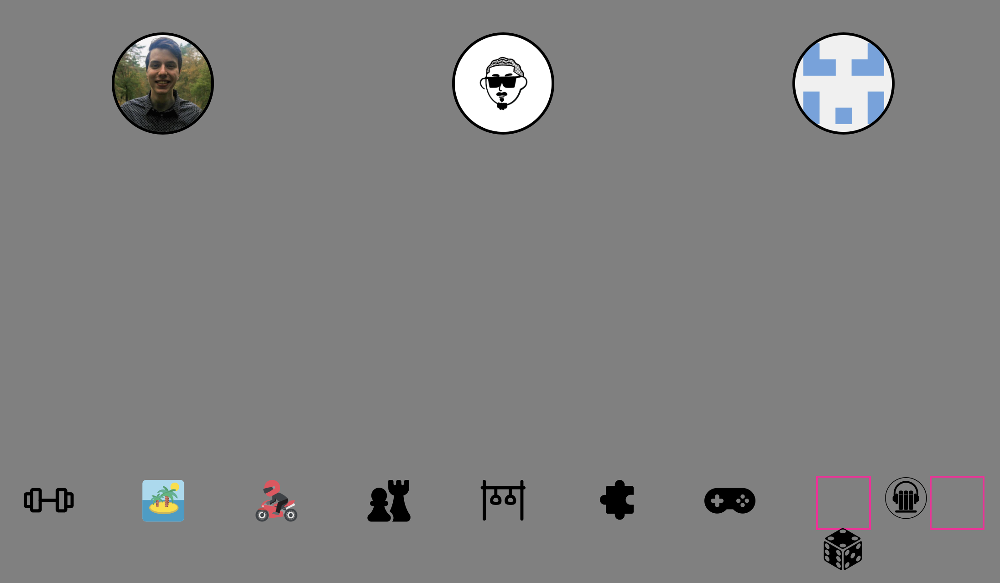
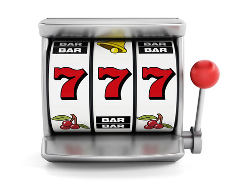
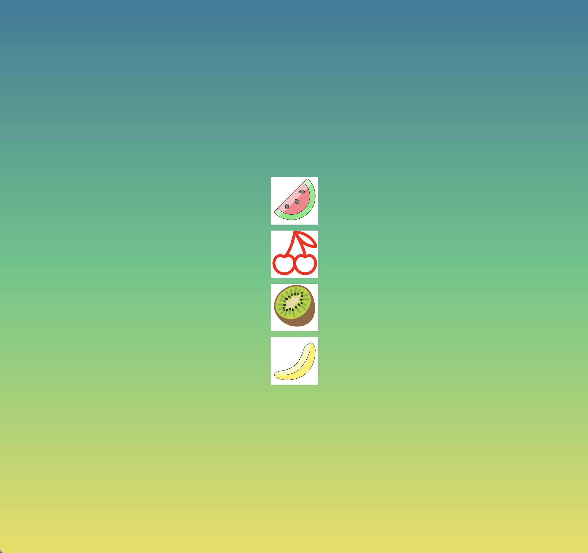

# Sprint 2

## Week 1/ Dag 1

**Wat heb ik vandaag gedaan:**
Tijdens de eerste dag van CSS to de rescue hebben we een oefening gedaan om te oefenen met css selectors wat ik heel lastig vond omdat ik gewend ben om id of classes te gerbuiken. Na dat hebben we groepjes gemaakt om een theorie uit te werken en dat te presenteren aan andere studenten de volgende dag. Mijn groepje had ankers om uit te werken. Ik had uiteindelijk een klein spelletje gemaakt die hobbys van de ene anker naar de andere anker annimeert.

Wat ik heel interessant vond is dat het animeren van ankers niet heel makelijk is. In de artikel stond dat je ankers op alle elementen kan gebruiken maar er stond niet of je elke element kan animeren wat dus bij mij niet heel goed ging.

**Hoelang duurde het:**
Het duurde mij 4 uurtjes om het goed te krijgen

**Wat heb ik geleerd:**
Ik heb geleerd hoe je kan werken met ankers wat ik zelf beter vind werken dan position absolut. Het geeft je veel vrijheid om posities te bepalen.

**Wat ga ik morgen doen:**
Morgen ga ik de theorie presenteren en aan de hand van wat we hebben gemaakt laten zien wat je ermee kan. Daarna krijgen we te horen wat de eindopdracht is en wat de regels zijn. Ik wil dat bepalen wat ik ga doen en als het kan al beginnen met een plan.

## Week 1/ Dag 2

**Wat heb ik vandaag gedaan:**
Vandaag hebben we te horen gekregen wat de eindopdracht is. Er waren 4 opdrachten waar we uit mochten kiezen. Ik heb gekozen om de controlpanel opdrachte te gaan maken.

Mijn idee is om een slotmachine te gaan maken zoals we die kennen in de casino.

Ik heb hierover met Sanne en Nils gesproken wat mijn besluit definitief maakte. Ik heb met Nils nog gesproken over hoe ik dit zou kunnen aanpakken. Aan de hand van een schets heeft hij dit kunnen uitleggen aan mij.

Ik heb toen een schets gemaakt van het ontwerp die ik wil gaan realiseren.

**Hoelang duurde het:**
Om tot op een idee te komen en een begin te maken duurde het mij ongeveer 2 uurtjes.

**Wat heb ik geleerd:**
Ik heb geleerd hoe ik een gradiend kan toepassen. Het werkte niet goed omdat ik de gradiend op de body deed maar de body is een element met een uitzondering en dat ik de hoogte moet geven van de body voor dat het echt kan werken.

**Wat ga ik morgen doen:**
Morgen ga ik mijn idee vertellen in de feedback groep en een beginnetje maken aan de eerste wiel van mijn slotmachine.

## Weekly Nerd (Peter paul koch)

Tijdens deze weekly nerd kwam gast spreker Peter paul koch praten over de history van browser tech. Hij ging uitleggen hoe de browser werkt en welke routes het maakt om webpaginas te tonen. Dat is iets wat ik eerder al gehoord had maar het was wel fijn om een refresher te krijgen.

Wat ik vooral interast vond was de geschiedenis van de browser. Ik heb mij hier nooit in verdiept wat nieuw voor mij was. De browser is heel vergekomen. Er waren zoveel browser vroeger waar ik zelf niks over had gehoord.

Wat ik nog had willen weten was wat hij vond van browsers die in de darkweb zijn zo als de thor browser. Helaas was ik dat nog vergeten te vragen.

Notes

Een browser is verbonden aan het web
Wat is een browser: 
Html: elementen
Css: hoe het eruit ziet

Dom: document object model. Kan javascript lezen.

Aom: accecebility object model: is voor voornamelijk bedoeld voor dingen zo als screenreader (assistent tech)

Interface: de elementen zo als buttons en searchbars

Javascript engine(als aparte component): is officieel geen onderdeel van de browser.

Parser: stukje programa dat een string neemt en inteperteerd en vertaal naar instructie die programma begrijpt

Browser Rendering engine: alles behalve javascript engine en interface.

Chrome en edge en opra en veel meer gebruiken engine: blink/chromium

Renderblocking: zorgt ervoor dat dingen gerenderd wordt zoals:
Css
Javascript, tenzij async of defer
Eerst dit renderen en dan de html omdat je anders html zonder styling eerst krijgt en dan derest wordt geladen .

Defer vs async twee verschillende manieren om de browser te zeggen dat je de javascript nodig hebt maar niet direct.

Backward compatibility:
Alles wat een browser ooit heeft gekund moet de browser voor altijd ondersteund worden.
[form objects].elements

<body bgcolor=“abdaca”>
<Frameset>

Browsers are the most hostile development platforms in the world
-douglas crockford: maker json

Eerste browser: www browser 1990

Worldwideweb.cern.ch: oude browser simuleren

Mosaic 1993 wilde plaatjes op een webpagina

Netscape 1994 Eerste echte browser

Internet explorer 1995 het was gratis waardoor netscape verdween

Opera: beste css
Konqueror 200 :omzeilde veel problemen die in andere browsers waren. Safari nam de renderen engine over van deze browser en verbeterde die en dat is nu : webkit safari

Safari ios 2007 had toche events. Was browser alleen voor de iphone

Chrome 2008 gebruikte webkit om opgebouwd te worden
Chrome splitten van webkit en maakte blink rendering engine

**Vrijdag Feedback Sessie: 1**
Tijdens de feedback sessie heb ik mijn idee kunnen tonen en heb ik tips kunnen krijgen over hoe ik dit kan aanpakken. Ik kreeg van Nils ook een bron waar ik naar kan gaan kijken dat gaat over de annimatie van de machine:
https://developer.mozilla.org/en-US/docs/Web/CSS/Reference/Properties/animation-composition

## Week 1 Samenvatting

In week 1 van Sprint 2 ben ik gestart met CSS to the Rescue. We oefenden met CSS-selectors, wat ik lastig vond omdat ik normaal vooral met classes en id’s werk.

Daarna werkte ik in een groep aan het onderwerp CSS anchors. Ik maakte een kleine animatie waarin elementen van het ene anker naar het andere bewegen. Ik leerde dat ankers veel vrijheid geven in positionering, maar dat animeren niet altijd eenvoudig is.

Op dag 2 koos ik voor de Control Panel eindopdracht. Mijn idee is om een slotmachine te maken. Na overleg en feedback heb ik een schets gemaakt en ben ik begonnen met de eerste opzet. Ik leerde hoe ik een gradient goed toepas en dat de body een hoogte nodig heeft om correct te werken.

Tijdens de Weekly Nerd van Peter-Paul Koch leerde ik meer over hoe browsers werken en over de geschiedenis van browsers. Vooral het principe van backward compatibility vond ik interessant.

In de feedbacksessie kreeg ik tips over de animatie van mijn slotmachine. Volgende week ga ik verder met het bouwen van het eerste draaiende wiel.

## Vakantie
Tijdens de vakantie wilde ik niet echt werken aan de opdracht maar ik heb toch twee dagen genomen om een begin te maken aan cubes maken aangezien ik er een aantal nodig heb. Ik wilde beginnen met het maken van 3 cubes om zo de draai rollen te maken die in de kast zit.

Ik heb de volgende bron geraadpleegd om mij opweg te helpen bij het maken van een cube: https://miocene.io/post/3d-cube-with-css/

Hier laat Julia Miocene zien hoe je aan de hand van de elemenet, before en een after een cube maken. In mijn situatie heb ik ervoor gekozen om de cube te maken door een aantal divs te gebruiken en daar svg's in te stoppen.

Eenmaal gelukt heb ik de cubes getest met een test annimatie. De uiteindelijke annimatie die ik wil gaan doen is de random die nu alleen nog in safari beschikbaar is. Daarvoor heb ik de volgende bron gebruikt: https://webkit.org/blog/17285/rolling-the-dice-with-css-random/

random op de annimatie:
@keyframes spin {
  from { transform: rotateX(0deg); }
  to {
    transform: rotateX(
      calc(
        random(8turn, 14turn, 1turn)
        + random(0deg, 270deg, 90deg)
      )
    );
  }
}

## Week 2/ Dag 1

**Wat heb ik vandaag gedaan:**
Vandaag ben ik bezig geweest met het maken van de kast van de slot machine. Opzich was het het zelfde als bij het maken van de wielen van de slot machine maar omdat het een reacht hoek was moesten de zijkanten/boevenkante een ander format krijgen. Dat besefte ik helaas niet dus was ik lang bezig met uitzoeken waarom het niet goed werkte. Dankzij sanne besefte ik dat het door de format was van de faces.

**Hoelang duurde het:**
het duurde me ongeveer 3 uurtjes om het goed te krijgen.

**Wat heb ik geleerd:**
Ik heb geleerd om varible width,hight en diepte te gebruiken om zo de cube zijdes de juiste format te geven. de min(0,0) zorgt voor een minimale en maximale format.
--w:min(90vw, 800px);
--h:calc( var(--w) * .6 );
--d:calc( var(--w) * .6 );

en dan veranderen bij de zijdes
width:var(--d);
height:var(--h);

Ook ben ik erachter gekomen dat ik niet woor elke 3d object een scene hoeft te maken maar beter 1 grote scene maken waar alle 3d objecten in zitten.

**Wat ga ik morgen doen:**
Morgen wil ik bezig gaan met de hendel van de slotmachine door de elementen te nesten om zo 1 hendel te creeeren. Dit zorgt ervoor dat ik meer kan oefenen met wat ik op dag 1 heb kunnen leren.

## Weekly Nerd (Nils binder)
Tijdens de weekly nerd van nils binder heeft hij gesproken over zijn bedrijf en heeft hij een antal van zijn projecten getoond aan ons. Wat ik heel interessant vond is hoe de figma design anders is dan het eindproduct. Het laat zien dat een eerste ontwerp niet altijd vast is en dat het atijd nog verbeterd kan worden. 

Wat ik ook interessant vond is het feit dat het web tegenwoordig meer kan dan wat je in figma kan doen. Ik dacht altijd dat figma juist meer kan dan het web en dat het web moeilijker is dan een figma design maken. Hij vertelde ook dat mensen vroeger photoshop en andere programmas gebruikten om websites te ontwerpen, ik kan me niet voorstellen dat iemand dat vandaag nog zou gebruiken. Het heel interesaant om te zien hoe ver webdesign is gekomen vergeleken met vroeger.

Notes

9elements

Units at 9 elements:
Communication design
Product development 
Web development 

They try to work together and work at office so the different departments can work together.

Schalke 04 ux design
Interessant hoe verschillende afdelingen binnen een team idee brengen to zo een groot project.
Vroeger gebruikte mensen van alles om websites te ontwerpen zo als photoshop.

De manier om een drop shadow to zetten in photoshop is heel ingewikkeld vergeleken met figma. 

Figma is ingesteld zo als css. Als je kijkt naar aligning dan is dit eigelijk net als flexbox.
Vroeger waren bepaalde dingen die je deed in photoshop niet mogelijk op de web. Nu is het anders nu is niet alles wat je op de web kan doen kan je doen in figma.
Animatie kan je met stappen doen dus als je 30 images heb dan kan je dat in stappen tonen zodat het lijkt alsof het een 3d element is die draait
Subgrid
First line selector om een eerste line van een text te stylen
Viewtransitions loads a new page

## Week 2/ Dag 2

**Wat heb ik vandaag gedaan:**
Vandaag ben ik bezig geweest met het maken van de hendel van de slot machine. Het is de bedoeling om alle onderdelen van de slot machine te nesten, zodat als ik het annimeer alles mee draait. Ik vond het heel lastig bij het maken van de balk vormige elementen. Wat ik niet besefte is dat ik de maat van sommige zijdes moest aanpassen om het goed te krijgen. Met behulp van sanne's uitleg begreep ik beter wat ik moest doen. Uiteindelijk heb ik de draaimechanisme af kunnen krijgen en de hendel balk waar later de knop op komt.

**Hoelang duurde het:**
- het duurde mij 2 uurtjes om de balk en de draai mechanisme goed te krijgen. Maar dat komt omdat het mij maar steeds niet lukte.

**Wat heb ik geleerd:**
Ik heb geleerd met variable maaten te werken om zo de zijdes van een 3D object met verschilende lengtes in elkaar te kunnen zetten zoals een balk.

**Wat ga ik volgende week doen:**
- annimatie aan de hendel toevoegen
- koppelen aan de wielen
- het random laten spinnen zodat de uitkomst altijd anders is. (random() van safari)
- win tekst tonen als drie wielen op de zelfde svg stoppen

**Vrijdag Feedback Sessie: 2**
Tijdens de feedback sessie heb ik mijn progressie kunnen tonen en waarmee ik aan het werken was. Ik heb uitgelegd dat ik de hendel wil nesten zodat het makkelijk is om te annimeren later. Ik heb niet echt tips gekregen maar wel tops namelijk, dat het er al best goed uit ziet.

**Week 2 samenvatting**
In week 2 ben ik verder gegaan met het bouwen van mijn slotmachine. Aan het begin van de week heb ik gewerkt aan de kast van de machine. ik leerde hoe ik met variabele breedte, hoogte en diepte de verschillende zijdes van een 3D object goed kan opbouwen. Ik kwam er ook achter dat het slimmer is om niet voor elk 3D object een aparte scene te maken, maar om één grote scene te gebruiken waar alle 3D onderdelen in staan. Ik maakte steed een nieuwe 3d scene wat in dit geval onnodig was.

Later in de week ben ik bezig geweest met de hendel van de slotmachine. Het was de bedoeling om alle onderdelen te nesten, zodat ik de hendel later makkelijker kan animeren. Vooral de balkvormige onderdelen vond ik lastig, omdat ik eerst niet doorhad dat sommige zijdes andere afmetingen moesten krijgen. Met hulp en door te blijven proberen is het uiteindelijk gelukt om het draaimechanisme en de hendelbalk te maken.

Tijdens de Weekly Nerd van Nils Binder vond ik het interessant om te zien hoe ontwerpen uit Figma in de praktijk nog veranderen tijdens het bouwen. Ook vond ik het opvallend dat het web tegenwoordig op sommige vlakken meer kan dan designsoftware, terwijl ik altijd dacht dat het andersom was. In de feedbacksessie heb ik mijn voortgang laten zien en kreeg ik terug dat mijn uitwerking er al goed uitzag. Volgende week wil ik verder met het animeren van de hendel, het koppelen aan de wielen en het onderzoeken van random() in Safari voor de uitkomst van de slotmachine.

## Week 3/ Dag 1

**Wat heb ik vandaag gedaan:**
Vandaag ben ik bezig geweest met de random() functie die nog alleen werkt in safari. Het was opzich niet zo moeilijk om in mijn spel te implementeren. Waar ik wel tegen aan liep is dat ik maar geen manier kan vinden om een win conditie te maken omdat de random waarde een stijl waarde is die ik nergens anders kan gebruiken. Ik heb geprobeerd met value een winconditie te maken maar dan is het niet echt random maar een al bepaalde win. De random een vast waarde geven was een optie maar dan is het ook geen echte random. 

Wat ook een probleem was, was dat de random maar 1 keer werkte. Dit komt omdat als de random geactiveerd wordt het een styling activeerd op een element. Als je dan de checkbox weer clickte om het te deactiveren en dan weer clickte om het te activeren, dan kreeg je dezelfde uitkomst als de eerste keer dat je erop clickte. Pas als je de page een refresh gaf was de random weer echt random maar dan weer alleen bij de eerste click. Als oplossing wilde ik een button type reset gebruiken maar dat werkt niet omdat de random ounthouden blijft in de catch van de browser. Dus de enige oplossing was de submit button omdat dat de page refreshed wanneer je op submit drukt.

Helaas na al dat proberen was de dag voorbij. Aan het einde kreeg ik te horen van een mede student dat er wel een manier is om de waarde uit random te gebruiken, namelijk met (element-shared). Als je dat bij random zet dan slaat het de uitkomst op in een variable naam. Ook van Jelle kreeg ik te horen dat ik container style queries kon gebruiken als een soort if els statement in css. 

**Hoelang duurde het:**
Ik ben de hele dag bezig geweest zonder een goede uitkomst. Wel met veel nieuwe leer momenten.

**Wat heb ik geleerd:**
- Ik heb geleerd hoe ik de Safari-only random() functie in mijn spel kan gebruiken.
- Ik heb geleerd dat random() een stijlwaarde oplevert en daardoor lastig te gebruiken is voor spel-logica zoals een winconditie.
- Ik heb geleerd dat de browser die styling-uitkomst kan onthouden, ook als ik een checkbox weer uit en aan zet.
- Ik heb geleerd dat element-shared een manier kan zijn om de uitkomst van random() te bewaren onder een variabelenaam.
- Ik heb geleerd dat container style queries mogelijk gebruikt kunnen worden als een soort if/else-logica in CSS.

**Wat ga ik morgen doen:**
- Morgen wil ik met de containe/style queries gaan kijken of ik een win conditie kan maken.
- kijken of ik met (element-shared) de waarde van de random kan hergebruiken.

## Week 3/ Dag 2

**Wat heb ik vandaag gedaan:**
Vandaag ben ik bezig geweest met de win conditie. Ik ben erachter gekomen dat de style quaries de element-shared van random() niet kan uitlezen. Hierdoor kan ik dus geen win conditie maken zoals ik die had gewild. 

**Hoelang duurde het:**
Ik ben de heledag bezig geweest met het proberen te realisern van de win conditie (5 uurtjes)

**Wat heb ik geleerd:**
Ik heb de limieten van de random() in safari kunnen bereiken en ontdekt wat wel en niet kan.

**Weekly nerd Robert broersma: ff formulieren maken**
Wat ik interessant vond aan deze Weekly Nerd is dat formulieren veel meer zijn dan alleen een paar invoervelden onder elkaar zetten. Ik vond het vooral sterk dat er werd uitgelegd hoe belangrijk gebruiksvriendelijkheid en duidelijkheid zijn voor de ervaring van de gebruiker. Dingen zoals alleen de noodzakelijke informatie vragen, autocomplete gebruiken, fouten duidelijk terugkoppelen en invoervelden logisch ordenen lijken klein, maar maken een formulier veel fijner om in te vullen. Ook vond ik het interessant dat er aandacht was voor toegankelijkheid, zoals goede kleurcontrast, duidelijke labels en grote klikvlakken. Bepaalde informatie die werden verteld had ik nog niet eerder gehoord in de lessen dus het was ook extra kennis die hij mij heeft bij gebracht zoals, alleen de niet verplichte velden aangeven.

Notes

Jean-Carlos: Opbouw van een formulier:
1.Intro tekst 
Mensen waren niet blij met de tekst het duurd 5 mijn om de formulier af te ronden(niet gebruiken ). Autocomplete handig.

Wet: je mag geen onnodige gevens vragen.

Alleen de niet verplichten velden aangeven.
Informatie vragen die modig is 
Gebruiker kan de invoer waarde controleren wijzigen en ongedaan maken 
Na volgende of verzenden een samenvatting van alle fouten 
Na verzenden verschijnt een duidelijke bevestiging
Opslaan en later verder is super fijn

Inhoud van een form:

Alleen info die nodig is 
Verplichte velden goed aangeven 
Uitleg waarom info nodig is 
Vraag dezelfde info niet 2 keer 
Geen jargon of afkortingen
Design van de componenten:

Kleur contrast van componenten 
Contrast van helper tekst
Zijn de componenten groot genoeg. 44x44px is gebruiksvriendelijk

Design van formulier:

Plaats buttons aan het begin van de regel 
Voortgang wordt getoond boven aan de formulier.
Navigatie consistent bij elke stap 
Het is duidelijk in welke stap het formulier daadwerkelijk wordt verzonden 
Elke invoerveld heeft een zichtbare label dat boven het invoer staat

Flow form:

Staan de velden in logische volgorde.
Meerdere manieren voor contact mogelijkheden.
Wordt hulp op meerdere plekken aangeboden?
Voortgang boven het form.
Als je kan inloggen bekende gegevens alvast invullen voor de gebruikers.
Knippen en plakken overal toestaan. 
Autocomplete als het kan.

**Wat ga ik volgende week doen:**
- een variable font zoeken die ik kan gebruiken en onderzoeken hoe ik het kan annimeren
- thema maken voor het spel

**Week 3 samenvatting**

## Week 4/ Dag 1

**Wat heb ik vandaag gedaan:**
Vandaag ben ik bezig geweest met het afmaken van de annimatie van mijn slot machine. Ik heb ontdekt dat ik met round de grades afronden naar een dichtbijzijnde grade. Ook heb ik gewerkt met style quaries om een thema te maken voor de website.Ik heb ook 4 buttons gestyled en laten werken. 3 buttons waren elk voor 1 wiel om het te stoppen en de vierde button is een submit zodat je het spel kan resetten. ik heb voor de h1 een shadow geanimeerd waardoor het lijkt alsof de h1 aan het pulsen is.

samen met niels ben ik gaan kijken of er nog een optie was om een win conditie te maken. Volgens niels is dat wel mogelijk maar dan moest ik de container quarie op de parrent zetten met ook alle annimatie zodat ik dan met costum properties de annimatie aan de childrents kan toevoegen. Helaas heb ik niet genog tijd gehad om het te kunnen proberen.

**Hoelang duurde het:**
- stijl voor de tweede thema 1 uurtje
- buttons stylen en laten werken 2 uurtjes
- animeren h1 30 min
- round() 20 min

**Wat heb ik geleerd:**
- Ik heb kennis gemaakt met round van css
- Hoe je een text shadow kan stijlen en welke waardes er zijn (horizon - vertical - blur)
- hoe je meerdere has kan combineren om een bepaalde uitkomst te realiseren.

**Vrijdag Feedback Sessie: 3**
Tijdens de feedback sessie heb ik mijn progressie kunnen tonen en waarmee ik die dag mee bezig was. Ik heb die dag gesproken over de winconditie die als maar niet lukte met de random() van safari. In dat gesprek heb ik de conclussie getrokken om de random van safari achter me te laten en het te gaan proberen door een random te maken met @property. Dit heb ik besloten omdat random ook maar 1 keer werkt bij een click en dat was niet wat ik had verwacht. met de @property wil ik nog een laatste poging gaan doen om een winconditie te maken.

**Week 4 samenvatting**

## Bronnen
Cube:
https://miocene.io/post/3d-cube-with-css/

Transform origin: 
https://developer.mozilla.org/en-US/docs/Web/CSS/Reference/Properties/transform-origin

Random (Safari only):
https://webkit.org/blog/17285/rolling-the-dice-with-css-random/

- Google Fonts:
  https://fonts.googleapis.com/css2?family=Oi&family=Oswald:wght@200..700&family=Pacifico&family=Poppins:ital,wght@0,100;0,200;0,300;0,400;0,500;0,600;0,700;0,800;0,900;1,100;1,200;1,300;1,400;1,500;1,600;1,700;1,800;1,900&family=Reddit+Sans+Condensed:wght@200..900&display=swap
- CSS text gradient:
  https://stackoverflow.com/questions/8384751/css-text-gradient
- CSS custom properties animatie voorbeeld:
  https://codepen.io/enbee81/pen/wvOVypZ?editors=1100
- MDN `@property`:
  https://developer.mozilla.org/en-US/docs/Web/CSS/Reference/At-rules/@property
- MDN container size en style queries:
  https://developer.mozilla.org/en-US/docs/Web/CSS/Guides/Containment/Container_size_and_style_queries
- Safari / WebKit `random()`:
  https://webkit.org/blog/17285/rolling-the-dice-with-css-random/
- CSS button generator:
  https://www.bestcssbuttongenerator.com/#/18

Chat GPT bronnen:

Prompt: “Waarom kan ik met CSS custom properties zoals --rol1, --rol2 en --rol3 geen winconditie maken?”

Prompt: “Hoe gebruik ik :has() in CSS om een element zichtbaar te maken als meerdere inputs checked zijn?”

Prompt: “Waarom werkt animation-play-state: paused niet en hoe koppel ik dat met :has() aan checkboxen in de footer?”